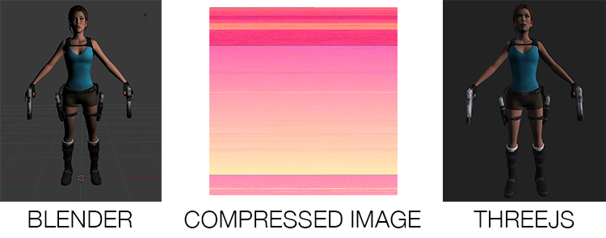

[](https://gitter.im/JordanDelcros/OBJImg?utm_source=badge&utm_medium=badge&utm_campaign=pr-badge&utm_content=badge)
[[](https://badge.fury.io/js/objimg)](https://www.npmjs.com/package/objimg)

# OBJIMG

Convert OBJ/MTL files (exported from a 3D soft) into a lightweight image ready for THREE JS (or native WebGL).

## Wait! what?
Ok, an OBJ file contains all informations about the 3D model: vertices, faces, normals, UVs, groups and materials...
All these informations are translated into colours and stored into one single image.

## Why?
First of all, for the fun!

Then cause it save disk space (the compression method can save up to 80% on the file size, or maybe more) and it reduce the files to load from 2 (OBJ and MTL) to only 1 (except textures).

## Example


This Lara Croft 3D model contains 74764 vertices, 48549 uvs, 74690 normals and 143290 faces dispatched in 12 differents groups.
On the left, you can see the OBJ/MTL into Blender, at center, the compressed image containing all datas, and on the right, the THREE object builded from the image.

As you can see, the two rendered models looks similar but there is a huge difference, their sizes.
The weight of the OBJ/MTL files is around 14Mo and the compressed image weight is around 4Mo only!

## How to?
The `OBJImg` Class contains both methods to parse and generate the images.

#### Import 3D model from image
To import the model from an image, link the `objimg.js` script to your html then do this:
```javascript
var model = new OBJImg({
	image: "path/to/model.png",
	onLoad: function( datas ){
	
		// datas are all vertices, normals, uvs, faces, groups and materials
		console.log("RAW datas: ", datas);
	
	}
});
```

#### Options & methods
##### Options
 - **image:** path to the image
 - **useWorker:** [boolean] define if the script will use worker to avoid main-thread freezing (default false)
 - **reveiveShadow:** [boolean] define if the THREE-JS object will receive shadows (default false)
 - **castShadow:** [boolean] define if the THREE-JS object will cast shadows (default false)
 - **onLoad:** [function(datas)] called when the datas are successfuly parsed from the image
 - **onErro:** [function(error)] called when an error occurs

##### Methods
 - **getObject3D:** [callback] return a complete THREE-JS `Object3D` (require THREE-JS)
 - **getSimpleObject3D:** [callback] return a THREE-JS `Object3D` ignoring groups (require THREE-JS)

#### Use with THREE-JS
```javascript
var model = new OBJImg({
	image: "path/to/model.png",
	receiveShadow: false,
	castShadow: false
}).getObject3D();

scene.add(model);
```

### Generate image from 3D model
To generate an image model, you can use the `OBJImg` Class script or the Command Line Interface.

#### Using the Command Line Interface

All informations are on [the npm page](https://www.npmjs.com/package/objimg).

#### Using the Class script
It is very easy to implement, just link the `objimg.js` script to your html then do this:
```javascript
OBJImg.generateIMG({
	obj: "path/to/file.obj",
	useWorker: true,
	done: function( datas ){
	
		var image = new Image();
		image.src = datas;
	
	},
	error: function( error ){
	
		console.error(error);
	
	}
});
```
When an image is created, you can access it in the developer tools over resources tab, or you can append it to the DOM to save it or drag it.

##### Options
 - **obj:** the path to the OBJ file or the OBJ content itself
 - **mtl:** the MTL file content (optional, only if the obj is content and not a path)
 - **useWorker:** boolean definning if the script is executed into a webworker to avoid main-thread freezing
 - **done:** callback function with datas parameters (datas is is base64 encoded image)
 - **error:** callback function when the script fail to generate image

If the `obj`parameter is a path, the script will parse the content for a MTL lib (path to the MTL).